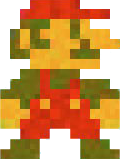

# Procesverslag

## Ontwerper

### Ontwerper:
Vanessa Choe
#### Startniveau:
Blauw

# Plan

<h1>Welkom in mijn procesverslag van mijn project,  Mario door de jaren heen!</h1>

Met het vak interface&interactie heb ik de opdracht gekregen om een tijdlijn of evolutie van een bepaald karakter te visualiseren in een interactief HTML/CSS prototype.

Hiervoor heb ik gekozen om met het karakter Mario te gaan werken. Ik heb Mario gekozen, omdat ik vroeger een aantal games van Mario heb gespeeld op de Nintendo DS. Denk hierbij aan Mario Bros, Mario kart en nog een heleboel andere games. Mario staat dan ook bekend om de bekende games, waardoor mij het leuk om een interactief game te maken waarbij ik verschillende Mario's door de jaren heen laat zien.

Mijn concept is gebasseerd op de game Super Mario Bros. Mij leek het leuk om verschillende opvallende elementen uit de game te gebruiken en hiermee mijn concept gelijk herkenbaar te maken. Hierbij vind ik het belangrijk dat de game niet al te moeilijk is en het makkelijk te spelen is.

  
Versie 1 Mario door de jaren heen

  ### De eerste versie/schets:
  

  ### Je ambitie: 
  Aan deze technieken/punten wil ik werken:
  - Beter worden in css
  - Beter worden in Javascript
  - Kritisch oplossingen bedenken tijdens het coderen
  - Een soortgelijke mario bros game maken

  

  Inn de eerste schets zie je een Mario uit 1985. Het is de bedoeling dat Mario kan springen op de buizen en vervolgens omhoog tegen een vraagtekenblokje kan springen om zo steeds een vernieuwde variant van Mario te krijgen. Hierbij is het idee hoe hoger hoe nieuwer de Mario zal zijn die verschijnt. Als Mario helemaal aan de top is kan hij springen naar het vlaggetje van het kasteel en prinses Peach redden. Wat duidelijk is bij dit idee, is dat de toekomstige interface van dit ontwerp dus erg herkenbaar en makkelijk is. De buizen vormen een trap waardoor de gebruiker al gelijk denkt dat mario omhoog moet om de finish te kunnen bereiken.

## Voortgang/Feedback 1

  
Feedback ronde 1

  ### Feedback
  - Misschien ook een mogelijkheid om terug naar beneden te gaan
  - Misschien dat je de achtergrond en elementen ook mee kunt laten veranderen met de tijd
  - Leuk concept het doet me erg denken aan mario.
  - Misschien geluidjes door de jaren heen
  - Idee misschien peach in het kasteel plaatsen en af en toe te in beeld brengen 
  #### Oplossing
  - Eerst focussen op vooruit dan ga ik aan de slag met achteruit.

  - Dit lijkt mij een goed idee om later in het proces even op terug te blikken. Voor nu focussen op 1 achtergrond. Later kan ik altijd meerdere achtegronden toevoegen van verschillende jaren.

  - Mij leek het leuk om om in iedere geval springgeluiden toe te vagen wanneer Mario springt. Als tip heb ik gekregen om eventueel Mario geluidjes door de jaren heen toe te voegen.

  - Leuke detail! Niet per se gericht op Mario, maar deze detail kan het spel wel unieker maken.

  ### Iteratie

  Na wat uitgeprobeerd te hebben in HTML en CSS ben ik op de conclusie gekomen om de buizen weg te laten. Dit omdat ik dan Mario eerst op de buis moet laten springen en vervolgens weer omhoog moet laten springen om een nieuwere versie van Mario tevoorschijn kan laten halen. Hiertussen zitten ook een paar stappen tussen (bijvoorbeeld animaties en Javascript) die voor mij niet haalbaar zijn om het binnen 1,5 week te doen. 

  Daarom heb ik gekozen om alleen de vraagtekenblokjes in het ontwerp te houden. De vraagtekenblokjes zijn ook goed herkenbaar voor de meeste mensen waardoor je het weghalen van de buizen kan beschouwen als het weghalen van een versiering uit de game.

  

## Voortgang/Feedback 2

  
Feedback ronde 2

  
  ### Feedback
  - Custom properties missen
  - Weinig/geen comments
  - Nog wat onnodige classen
  - Nog geen nette code 
  - Gebruik aLleen engels of nederlands in je code
  - States werken niet helemaal
  - Styling van de buttons passen nog niet helemaal bij het ontwerp

  #### Oplossing
  - Custom properties missen inderdaad nog, ik had nog geen tekst in mijn prototype verwerkt. Dit ga ik oplossen door jaartallen van de Mario's toe te voegen.

  - Ik kan nog wat meer comments toevoegen in HTML, CSS en Javascript om bepaalde functies uit te leggen, maar ook om mijn code geordend te houden.

  - Classen zal ik weghalen

  - Code is nog niet netjes, ik heb nog best veel dubbele code in CSS staan. Mijn code netjes maken doe ik dan ook meestal op het einde pas.

  - De states werken inderdaad nog niet. Dit kwam doordat er op de eerste twee blokjes een animatie maar ook wat styling zat waardoor bijvoorbeel active state niet te zien was op de blokjes, maar er wel was. Dit ga ik oplossen door me beter te verdiepen in de styling van de buttons.

  - De styling van de buttons ga ik nog aanpassen op het jaartal van de Mario die uit een blokje tevoorschijn komt.

  ### Iteratie

  

  Na de feedback ronde heb ik wat aanpassingen gedaan op mijn ontwerp. Ik heb onder andere de blokjes een passende styling gegeven en wat meer onderzoek gedaan naar de blokjes door de jaren heen. Daarnaast ben ik ook nog aan de slag gegaan om Mario steeds te laten springen naar het volgende blokje. Dit vond ik in eerste instantie best wel moeilijk, maar naar wat meer naar animaties te hebben gekeken, lukte mij dit aardig. Toen kwam het volgende probleem en dat was dat Mario wel van het eerste blokje naar de tweede blokje kon springen, maar niet verder. Terwijl ik dezelfde code had toegepast. Later naar wat uitproberen en hulp te hebben gevraagd, bleek dat ik de code in de animatie op twee regels had geschreven terwijl het op 1 regel moest en daarnaast had ik twee verschillende animaties geschreven die elkaar steeds gingen overschrijven, waardoor ik uiteindelijk gewoon in 1 animatie een delay had moeten geven op de andere animatie bij het voeren van 1 functie. 

## Voortgang/Feedback 3

  
Feedback ronde 3

  
  ### Feedback
  - States werken nog steeds niet helemaal
  - Nog wat classes, en nog geen custom properties
  - Website werkt niet op github
  - Pixels omzetten naar em's
  - Comments toevoegen
  - H1 stylen

  #### Oplossing
  - States werken nog steeds niet helemaal. De hover states doen het nu wel op alle buttons. Ik kon dus geen hover state maken met een animatie voor twee buttons die ook al een animatie hadden. Dit werkte op de een of andere manier niet. Dit heb ik proberen te verhelpen door een een functie in javascript te schrijven en daarin classes toe te voegen met de animatie voor het hoveren, maar dat lukte ook niet. Uiteindelijk heb ik maar een hover state op de button gemaakt zonder een animatie toe te voegen tijden het hoveren. Dat lukte wel.

  De active states werken op een paar buttons. Uiteindelijk moest ik wat border en outlines en shadows verminderen/weghalen, omdat je de active state niet kon zien. Voor de active state heb ik box-shadow toegepast, maar dat kan je dan niet zien doordat het net onder de button viel waar ook nog een border omheen zat.

  - Custom properties heb ik nog geen aandacht aan besteed, omdat ik nog best wel veel met kleur aan het experimenteren bent voor de animaties en styling. Ik vind het dan niet handig om al custom properties aan te maken. Dus daarom heb ik besloten om dit op het einde te gaan doen. Classes zal ik ook langzamerhand proberen weg te halen.

  - Afbeeldingen en fonts worden niet geladen in Github. Dit zal waarschijnlijk aan mijn mappen structuur liggen en de source zal ik nog moeten veranderen in de html.

  - Ik heb vooral pixels gebruikt voor bepaalde box-shadows dat vind ik soms fijner en nauwkeuriger werken dan met em's. Dde px naar em's verander ik meestal allemaal in 1 keer op het einde.

  - Comments zal ik ook meer toevoegen, dit doe ik ook vaak meer op het einde als ik mijn code orden.

  - De h1's hebben nu allemaal dezelfde styling. Ik ga dit nog aanpassen door onderzoek te doen naar de verschillende cover van de games waar de namen van de games worden weergeven. Deze stylings zal ik dan ook toepassen op de styling van de h1's per jaartal.

## Reflectie

  
Reflectie/persoonlijke ontwikkeling

  ### Je uitkomst - karakteristiek screenshot(s):
  Mijn eindresultaat: Mario door de jaren heen!

  Mario 1985
  

  Mario 1988
  

  Mario 1990
  

  Mario 1991
  

  Mario 1996
  

  Mario 2002
  

  Mario 2007
  

  Mario 2012
  

  ### Dit ging goed/Heb ik geleerd: 
  Uiteindelijk heb ik Mario kunnen animeren en met Javascript kunnen laten springen en bewegen. Daarnaast een Mario laten verschijnen en weer naar beneden laten vallen is ook gelukt. Kortom heb ik geleerd om meerdere animaties binnen een functie te laten werken met verschillende classes die dan in de css worden toegevoegd. Zelf werk ik bijna nooit met Javascript en vond het daarom wel leuk en fijn dat ik me wat beter in Javascript, maar ook CSS kon verdiepen.

  Ondanks het feit dat dit vak in 1,5 week af moest, heb ik voor mijn gevoel toch meer geleerd dan andere vakken die we vaak niet in 1,5 week doen. Omdat we elke les hadden en we elke dag met dit vak bezig waren, zat ik er ook meer in en was ik echt alleen maar bezig met dit vak en niks anders. Daarnaast vond ik het ook fijn dat je veel tijd kreeg in de les om aan je werk te werken en dat er een studentenassisten beschikbaar was in de klas, maar ook na de les vond ik erg fijn.

  

  ### Dit was lastig/Is niet gelukt:
  Ik ben er niet aan toegekomen om Mario terug te laten springen/lopen. Mario vooruit laten lopen en springen was nam al veel tijd in beslag. Daarnaast had ik bij de verschillende jaartallen/achtegronden meer kleine animatie willen toevoegen, zoals het vliegen van bijvoorbeeld een sterretje of lopende schildpadjes, vliegende vraagtekenblokjes, lopende paddenstoel, sounds of bewegende wolkjes etc. Dit heb ik helaas niet kunnen doen doordat ik geen tijd meer had.

  

## Bronnenlijst

Bronnen

1. Alle Marios:  https://www.google.com/search?q=MARIO+TIMELINE&tbm=isch&ved=2ahUKEwjOovCexKP7AhU347sIHZweCsYQ2-cCegQIABAA&oq=MARIO+TIMELINE&gs_lcp=CgNpbWcQAzIECCMQJzIECAAQHjIECAAQHjIECAAQHjIECAAQHjIECAAQHjIGCAAQBRAeMgYIABAFEB4yBggAEAUQHjIGCAAQBRAeOgcIABCxAxBDOgUIABCABDoECAAQQzoICAAQgAQQsQM6BAgAEAM6CAgAELEDEIMBUIsIWJEWYIYZaABwAHgAgAFViAGzB5IBAjE1mAEAoAEBqgELZ3dzLXdpei1pbWfAAQE&sclient=img&ei=mONsY872N7fG7_UPnL2osAw&bih=666&biw=1333#imgrc=aRbxbTTsU4n-HM

2. Achtergrond 1985: https://lens.google.com/search?p=AcLkwR3zAjsvQOf0VcPaeMBniFzIUjoC2ykB9H0DcotUQP209sWnM_VFAWqYdibOpPvQtmlhEGMK-3OoK6Xcl-LucfjSwKD5kdyW7jAmlINHT4GWmAxMAcFePTvc9e8YOdJzMa50HqhAp6zvndPYFAv8j_9VkHLpUvUFiVxz21X4q-Lsr8TKLLvp36f6nTyp1YwI5lR1EJL6eUiCaYH4KoMO6dO9775iAXZ0CyltRRLzW09vLKCXnj5r3uZPcmAEhIG70FetEo6ZwJuxRC7Pz-jofXxG8DAHbd5iTdNEk26fBz43mzUdoaCdk9wkZB_bAvtAZce2aEohqfK5fU74LPr0nSnm6GEAJUWf78JHK4mWDSUiAwxxO6w_&ep=gisbubb&hl=nl&re=df#lns=W251bGwsbnVsbCxudWxsLG51bGwsbnVsbCxudWxsLG51bGwsIkVrY0tKR1JqTmpVME1qbGlMV0ZqTXpJdE5EQmlOeTA0WlRneUxUVTJOV1UyWmpnMU9EZGlZeElmVlROd1pVdFlNbUZHUzFsWFVVUjFWV2RKVkUxaWJEZG5lVEJGWkZKb1p3PT0iLG51bGwsbnVsbCxudWxsXQ==

3. Achtergrond 1988:https://www.google.com/search?q=mario+bros+1990+background&tbm=isch&ved=2ahUKEwif0-DX4KP7AhWF8rsIHRRqA1QQ2-cCegQIABAA&oq=mario+bros+1990+background&gs_lcp=CgNpbWcQAzoECCMQJ1DrGViZHmCdIGgAcAB4AIABW4gB7wKSAQE1mAEAoAEBqgELZ3dzLXdpei1pbWfAAQE&sclient=img&ei=bAFtY5_tF4Xl7_UPlNSNoAU&bih=666&biw=1333#imgrc=vpR1PgAlTG2G4M 

4. Achtergrond 1991:https://www.deviantart.com/tag/supermariobrosallstars 

5. Achtergrond 1996: https://lens.google.com/search?ep=gisbubb&hl=nl&p=AcLkwR2-wTbuUH4aHdDl9NTDlWTIRACLJnaE32ETTRdEiRsvoJUrSKSBumB7iOXvE0neV1ivBtrrZwcOAB0q0jX9UPWuiCgMnfO9ZQ65WhtKTv26KYBwlKBiiOnTDLX4muIKplwI1eY7fIdvIMVTJj0-PiwSYbStQ4RVvov3zd0vsRT-IWstPfY5dsJSBlGKn5szLlL4A7yPr4U9Vfh69JuSfanqyEp_StxUzUiSJ4kOsunBpaSZgsU_R8xxNDtEFcIoDqyhlLh5MWSb4TEP7cAF0_ik4B60iPviDkQ1sgve8ZdRhBhGe33Pdyzw82CtN-xF8mgs5JTaISibQ8vECZrm6jGdcoe3KQhDkGn4eoAGh7ce_nh8cyw%3D#lns=W251bGwsbnVsbCxudWxsLG51bGwsbnVsbCxudWxsLG51bGwsIkVrY0tKRGd5WldNMllURmlMVFJoWTJNdE5HTTNZUzA0TW1NNUxUSm1ZVGhoTldVMll6YzVOQklmVFMxa2RISkVOWE5sTFdOVlVVUjFWV2RKVkUxaWJEWjNPVWhaWkZKb1p3PT0iLG51bGwsbnVsbCxudWxsXQ== 

6. Achtergrond 2002:https://www.google.com/search?q=mario+bros+2002&sxsrf=ALiCzsY_0rpJbFAh806GCZtwlVln0tF04g:1668088401612&source=lnms&tbm=isch&sa=X&ved=2ahUKEwj084bF4aP7AhUW76QKHUGCARYQ_AUoAXoECAEQAw&biw=1440&bih=666&dpr=2#imgrc=t3ibUtJG7xQQeM&imgdii=kwj0t-oxUhDenM

7. Achtergrond 2007:https://www.google.com/search?q=super+mario+bros+2007&&tbm=isch&ved=2ahUKEwj_3KeE4aP7AhXYNOwKHd-ACP8Q2-cCegQIABAA&oq=super+mario+bros+2007&gs_lcp=CgNpbWcQAzIHCAAQgAQQEzoECCMQJzoICAAQBxAeEBM6BQgAEIAEOgQIABAeOggIABAFEB4QEzoICAAQCBAeEBM6BggAEB4QE1CTB1i8C2C4DGgAcAB4AIABWogB0gKSAQE1mAEAoAEBqgELZ3dzLXdpei1pbWfAAQE&sclient=img&ei=yQFtY7_UMtjpsAffgaL4Dw&bih=666&biw=1333#imgrc=6IFYvEyV1-YqTM

8. Achtergrond 202: https://mario.fandom.com/nl/wiki/Mushroom_Kingdom

